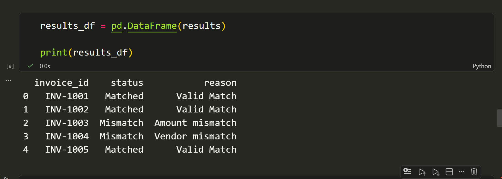
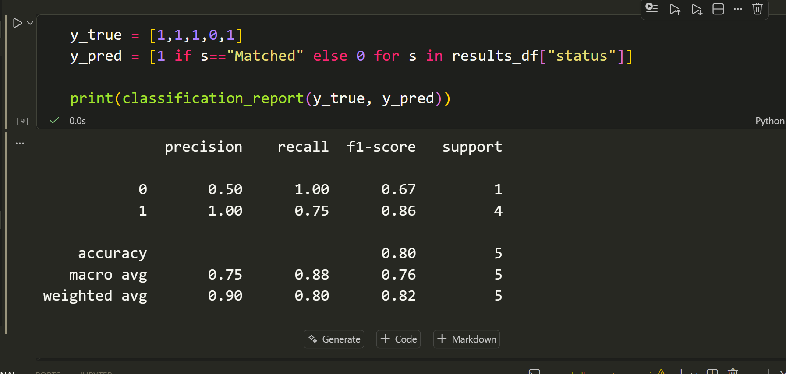
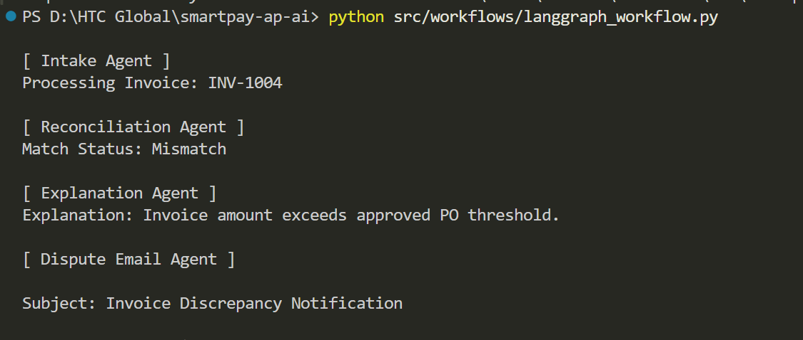
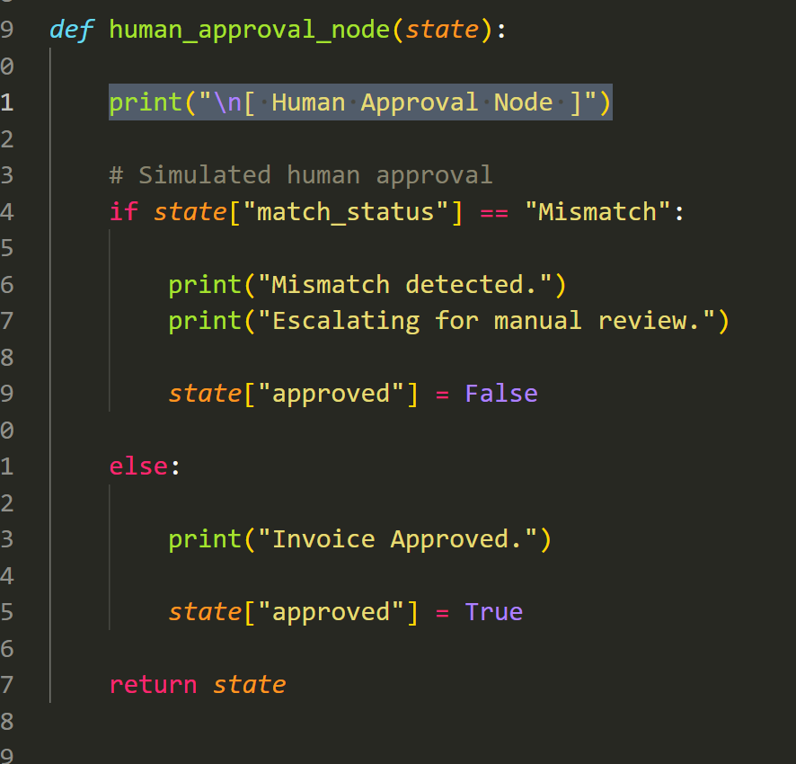

# smartpay-ap-ai
# SmartPay AP – Agentic AI Platform for Intelligent Accounts Payable Automation

> Enterprise AI Architecture Case Study  
> Author: **Harish Kumar Govindu**  
> Role Targeted: **AI Architect**  
> Focus Areas: Agentic AI, Enterprise AI Architecture, Multi-Cloud, Responsible AI, MLOps, Intelligent Financial Automation

---

# 1. Project Overview

SmartPay AP is a governed Agentic AI platform designed to automate enterprise Accounts Payable (AP) reconciliation workflows for Acme Manufacturing, a global organization processing approximately 1 million supplier invoices per month across 25 countries.

The platform combines:
- deterministic enterprise workflows
- lightweight machine learning
- LLM-assisted reasoning
- human-in-the-loop governance
- multi-cloud AI infrastructure

to enable intelligent invoice reconciliation while maintaining auditability, compliance, explainability, and operational trust.

The solution is designed as a minimal viable enterprise architecture demonstrating how Agentic AI can be safely operationalized in regulated financial environments.

---

# 2. Business Problem

Acme Manufacturing currently faces multiple AP operational challenges:

- High manual reconciliation effort
- Delayed invoice processing
- Slow vendor dispute resolution
- ERP integration complexity
- Limited auditability
- Compliance and GDPR constraints
- Lack of explainable AI-driven workflows

The CFO requires a next-generation AI-powered AP platform capable of:

1. Extracting invoice and PO data from PDFs, Emails, and EDI feeds
2. Matching invoices against PO/GRN records in SAP and Oracle
3. Explaining mismatches using AI-assisted reasoning
4. Drafting vendor dispute emails automatically
5. Triggering payment workflows with governance controls
6. Operating in Azure + AWS multi-cloud environments
7. Supporting Responsible AI and GDPR compliance

---

# 3. Architecture Overview

The architecture follows a layered enterprise AI design emphasizing:

- deterministic orchestration
- explainability
- modular services
- operational resilience
- governance-first AI

## High-Level Workflow

```text
Invoice Sources
(PDF / Email / EDI)
        ↓
OCR & Data Extraction
        ↓
Invoice Normalization
        ↓
PO/GRN Matching Engine
        ↓
Mismatch Detection
        ↓
AI Explanation Generation
        ↓
Vendor Dispute Drafting
        ↓
Human Approval Workflow
        ↓
ERP Payment Trigger
        ↓
Audit Logging & Monitoring
```

---

# 4. Solution Components

## 4.1 Ingestion Layer

Supported Input Channels:
- PDF invoices
- Vendor emails
- EDI feeds

Technologies:
- Azure Document Intelligence
- Microsoft Graph API
- EDI translation services

---

## 4.2 Extraction & Normalization Layer

Responsibilities:
- OCR extraction
- Entity extraction
- Schema validation
- Canonical invoice transformation

Normalized schema example:

```json
{
  "invoice_id": "INV-1001",
  "vendor": "ABC Corp",
  "currency": "USD",
  "amount": 12000,
  "po_number": "PO-2201"
}
```

---

## 4.3 Matching & Reconciliation Engine

Hybrid reconciliation approach:
- Rule-based validation
- Lightweight ML similarity scoring

Features:
- Vendor fuzzy matching
- Amount validation
- Currency consistency
- Tax validation
- Semantic line-item similarity

Recommended ML models:
- XGBoost
- RandomForest

Evaluation metrics:
- Precision
- Recall
- F1-score
- False Positive Rate

---

## 4.4 Agentic AI Workflow Layer

Framework:
- LangGraph

Agents:
- Intake Agent
- Extraction Agent
- Reconciliation Agent
- Explanation Agent
- Dispute Email Agent
- Human Approval Node

Key Design Principle:
> AI workflows are governed and deterministic rather than fully autonomous.

---

## 4.5 ERP Integration Layer

Supported ERP Systems:
- SAP
- Oracle ERP

Capabilities:
- PO retrieval
- GRN validation
- Payment workflow triggering
- Vendor workflow integration

---

## 4.6 Governance & Observability Layer

Capabilities:
- Audit logging
- Workflow tracing
- Drift monitoring
- Cost monitoring
- Security enforcement
- Responsible AI controls

---

# 5. Tech Stack

| Area | Technology |
|---|---|
| Programming Language | Python |
| Agent Framework | LangGraph |
| OCR | Azure Document Intelligence |
| LLM | Azure OpenAI GPT-4o |
| ML Models | XGBoost / RandomForest |
| Embeddings | Sentence Transformers |
| API Layer | FastAPI |
| Workflow Orchestration | LangGraph |
| Monitoring | Prometheus + Grafana |
| MLOps | MLflow |
| Drift Detection | EvidentlyAI |
| Tracing | LangSmith |
| Containerization | Docker |
| Orchestration | Kubernetes |
| CI/CD | GitHub Actions |
| Infrastructure as Code | Terraform |
| Cloud Platforms | Azure + AWS |

---

# 6. Repository Structure

```text
smartpay-ap-ai/
│
├── docs/
│   ├── architecture/
│   ├── diagrams/
│   ├── responsible-ai/
│   └── screenshots/
│
├── src/
│   ├── ingestion/
│   ├── matching/
│   ├── agents/
│   ├── workflows/
│   ├── utils/
│   └── api/
│
├── notebooks/
│   └── invoice_matching.ipynb
│
├── data/
│   ├── raw/
│   ├── processed/
│   └── sample_output/
│
├── tests/
│
├── requirements.txt
├── README.md
└── architecture.pptx
```

---

# 7. Setup Instructions

## 7.1 Clone Repository

```bash
git clone https://github.com/govinduharishkumar/smartpay-ap-ai.git

cd smartpay-ap-ai
```

---

## 7.2 Create Virtual Environment

### Windows

```bash
python -m venv venv

venv\\Scripts\\activate
```

### Linux / Mac

```bash
python3 -m venv venv

source venv/bin/activate
```

---

## 7.3 Install Dependencies

```bash
pip install -r requirements.txt
```

---

# 8. Running D2 — Matching Engine

The D2 deliverable demonstrates:
- invoice loading
- feature engineering
- ML-based reconciliation
- precision/recall evaluation

## Run Notebook

```bash
jupyter notebook
```

Open:

```text
notebooks/invoice_matching.ipynb
```

## Output Includes

- Match predictions
- Mismatch explanations
- Precision/Recall metrics
- Confusion matrix

---

# 9. Running D3 — Agentic Workflow

The D3 deliverable demonstrates:
- deterministic agent orchestration
- tool calling
- mismatch explanation
- dispute drafting
- human approval flow

## Run Workflow

```bash
python src/workflows/langgraph_workflow.py
```

## Workflow Sequence

```text
Intake Agent
    ↓
Extraction Agent
    ↓
Reconciliation Agent
    ↓
Explanation Agent
    ↓
Dispute Email Agent
    ↓
Human Approval
    ↓
ERP Workflow Trigger
```

---

# 10. Responsible AI Controls

The solution incorporates Responsible AI principles across the platform lifecycle.

## Privacy & GDPR

- PII masking before LLM invocation
- Encryption at rest and in transit
- Regional data residency enforcement
- Data retention policies
- Right-to-erasure workflows

---

## Human Oversight

Critical financial actions require:
- human approval
- escalation workflows
- audit verification

---

## AI Safety Controls

- Prompt injection filtering
- Deterministic validation layers
- Confidence thresholds
- Guardrails for unsafe tool usage

---

## Bias Mitigation

Potential risks:
- Vendor bias
- Regional imbalance
- Currency-related skew

Mitigation:
- Balanced datasets
- Periodic audit reviews
- Monitoring reconciliation drift

---

# 11. Architectural Trade-Offs

| Decision | Chosen | Rejected | Reason |
|---|---|---|---|
| Workflow Framework | LangGraph | CrewAI | Deterministic workflows |
| ML Model | XGBoost | Deep Learning | Explainability |
| Multi-cloud Strategy | Active-Passive | Active-Active | MVP simplicity |
| Governance | Human-in-loop | Fully autonomous AI | Financial compliance |
| OCR | Azure Document Intelligence | Tesseract | Enterprise accuracy |

---

# 12. Failure Handling Strategy

| Failure Scenario | Mitigation |
|---|---|
| OCR extraction failure | Retry + fallback parser |
| Low-confidence match | Human escalation |
| ERP downtime | Queue retry |
| Prompt injection attack | Input sanitization |
| LLM service outage | AWS Bedrock fallback |
| Hallucinated explanation | Deterministic validation |

---

# 13. Monitoring & Observability

## AI Monitoring
- Match confidence
- Drift monitoring
- Hallucination tracking
- Escalation rate

## Infrastructure Monitoring
- Queue depth
- Workflow latency
- API failures
- Token consumption
- Cloud cost utilization

## Observability Tools
- Prometheus
- Grafana
- LangSmith
- ELK Stack
- EvidentlyAI

---

# 14. Future Enhancements

Potential future roadmap enhancements include:

- Real-time fraud detection
- Supplier behavior analytics
- Autonomous anomaly detection
- Multilingual invoice understanding
- Reinforcement learning optimization
- Advanced AI-assisted negotiation workflows

---

# 15. Key Design Philosophy

The platform prioritizes:

- trust
- explainability
- operational governance
- financial safety
- scalability
- enterprise auditability

over uncontrolled AI autonomy.

The architecture demonstrates how Agentic AI can be operationalized responsibly within regulated enterprise financial systems.

---

# 16. Author

## Harish Kumar Govindu

AI Architect | Enterprise Architect | Full Stack Engineering Leader

Specializations:
- Agentic AI
- Enterprise AI Architecture
- Distributed Systems
- Azure & Multi-Cloud
- Microservices
- MLOps
- Responsible AI

---

# 17. License

This repository is intended for educational and evaluation purposes as part of an AI Architect case study submission.

# Screenshots

## Invoice Matching Engine



---

## Evaluation Metrics



---

## LangGraph Workflow



---

## Human Approval Node

